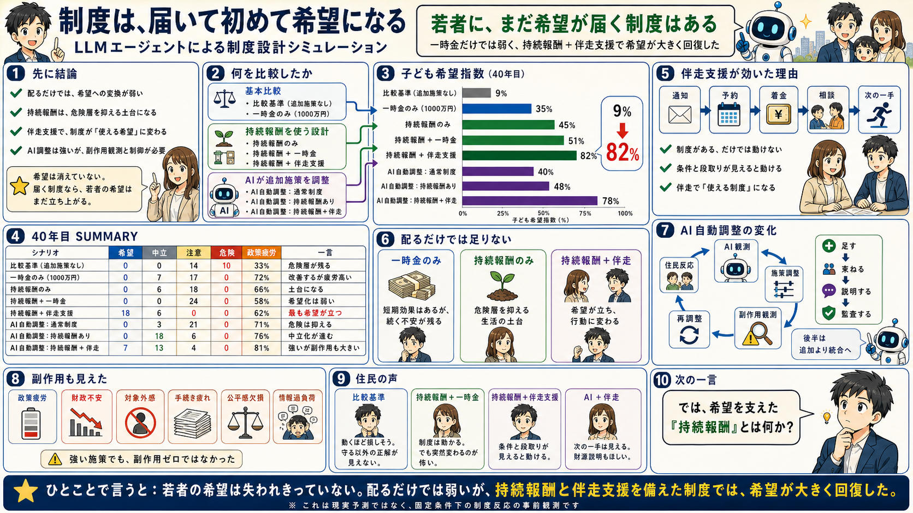
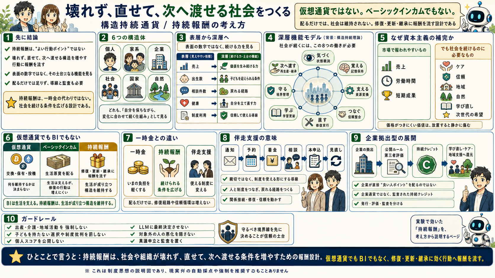
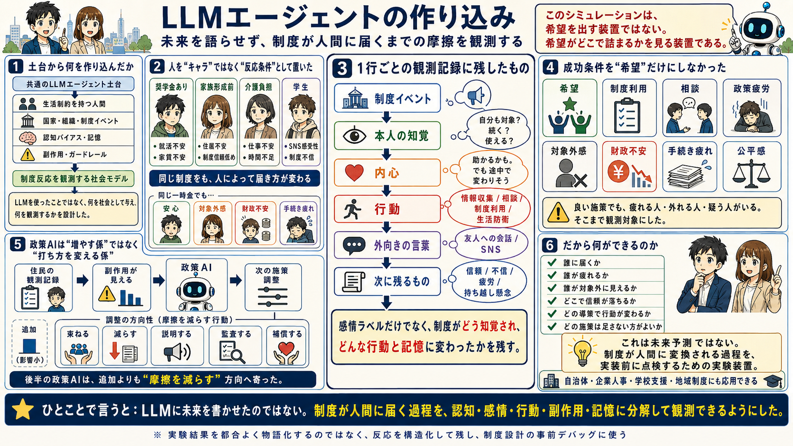

# 制度設計シミュレーション

**シンギュラボ AIエージェント社会シミュレーションハッカソン**

> 制度導入前に、シミュレーションでデバッグする。

AGI・AIロボ普及後の社会移行を題材に、制度や施策が人間の感情・行動・不信・疲労・制度利用にどう変換されるかを、LLMエージェントの row データとして観測するプロトタイプです。

「LLMで未来物語を作る」ではなく、**制度が社会に出たときの反応を実装前に観測する装置**として設計しています。

## デモ

| 種別 | リンク |
|---|---|
| 観測ビューア | [制度設計シミュレーション](https://karesansui-u.github.io/hackathon-singulab/visualization/future_emotion_map.html) |
| 作成スタジオ | [シミュレーション作成スタジオ モック](https://karesansui-u.github.io/hackathon-singulab/visualization/simulation_studio_mock.html) |
| 発表スライド | [GitHub Pagesで開く](https://karesansui-u.github.io/hackathon-singulab/presentation/) |


作成スタジオはUIモックです。現時点ではブラウザUIから新規シミュレーション生成は行わず、生成ボタンは「準備中」として制御しています。生成済み row の再生デモは上の観測ビューアから確認できます。

## 審査員向けの見どころ

- **LLMエージェントを会話相手ではなく観測センサーとして使う**
  人間、国家、組織の反応を、感情・行動・内心・SNS・制度利用・持ち越し懸念の row として保存します。
- **施策の効果だけでなく副作用を見る**
  希望が上がるかだけでなく、政策疲労、財政不安、対象外感、手続き疲れ、制度不信も観測対象にしています。
- **閉ループで次の社会状態へ戻す**
  世界イベント -> 国家反応 -> 日本社会状態 -> 組織反応 -> 個人反応 -> 社会フィードバック、という循環で step を進めます。
- **ドメインパックで転用できる**
  今回はAGI後の若者・家族形成を扱っていますが、企業人事制度、自治体施策、学校支援などへ差し替えられる構成です。

## 観測レイヤー

このデモは、マップ上の若者だけに感想を言わせるものではありません。国家・組織・若者世代・家族形成世代・次世代を分け、外部圧力が制度反応へ変換される過程を row データとして保存します。

```text
国家・世界圧力
  -> 組織判断
  -> 若者世代 / 家族形成世代
  -> 次世代への制度記憶
  -> 社会フィードバック / 政策AI調整
```

| レイヤー | 何を見るか | 主な出力 |
|---|---|---|
| 国家・世界 | 地政学、財政、エネルギー、SNS不安、日本への波及 | `country_turns.tsv` |
| 組織 | 採用、育成、AI導入、雇用維持、事業転換 | `organization_turns.tsv`, 組織判断イベント |
| 若者世代 | 進路、初職、学び直し、制度信頼、未来経路 | `agent_turns.tsv` |
| 家族形成世代 | 住居、所得、ケア、子ども意向、制度利用 | `agent_turns.tsv`, 子ども希望指数 |
| 次世代 | 制度記憶、不信継承、希望継承、長期の選択肢 | `child_cohorts.tsv`, `agent_turns.tsv` |

<p>
  
  
  
</p>

## まず動かす

### 1. GitHub Pagesで見る

ブラウザで次を開くだけです。LLMやPython環境は不要です。

```text
https://karesansui-u.github.io/hackathon-singulab/visualization/future_emotion_map.html
```

### 2. ローカルで静的デモを見る

```bash
python3 -m http.server 8000 --directory public
```

起動後、次を開きます。

```text
http://127.0.0.1:8000/visualization/future_emotion_map.html
```

### 3. LLMでrowを再生成する

本線の閉ループ生成は [scripts/run_closed_loop_llm_demo.py](scripts/run_closed_loop_llm_demo.py) です。時間とCLI利用量がかかるため、最初は2 step程度の小規模確認を推奨します。

```bash
python3 -m venv venv
source venv/bin/activate
pip install --upgrade pip
pip install -r requirements.txt

python3 scripts/run_closed_loop_llm_demo.py \
  --steps 2 \
  --scenario-mode no_intervention \
  --country-codes JPN \
  --organization-ids O02 \
  --agent-ids A01,W01 \
  --output-dir outputs/runs/smoke_no_intervention
```

詳しい実行方法は [docs/実行ガイド.md](docs/実行ガイド.md) を見てください。

## LLMバックエンドの状態

| 用途 | 状態 |
|---|---|
| 生成済みrowのデモ再生 | LLM不要。Pages/ローカル静的サーバで動きます。 |
| 本線のrow生成 | Claude Code CLI がデフォルトです。`--model gpt-*` または `--model codex` を指定すると Codex CLI 分岐を使います。 |
| 他のサブスクCLI | 本線へは未接続です。Gemini CLIなどは参考実装側に汎用CLI接続があります。 |
| ローカルLLM | Ollama接続は参考実装 [examples/spatial_demo](examples/spatial_demo/) にあります。本線へ接続するには同じ契約でアダプターを追加します。 |
| APIキー / `.env` | 現状の本線はCLI認証前提です。APIキー型にする場合はアダプターを追加して `.env` から読む形にします。 |

## シナリオ

主要な比較シナリオは次の通りです。

| `--scenario-mode` | 内容 |
|---|---|
| `no_intervention` | 追加施策なし。世界ショックと社会圧力のみ。 |
| `birth_grant_only` | 子育て初期一時金1000万円を中心にした出産支援のみ。 |
| `structure_intervention` | 構造持続通貨・住居・学び直し・地域ケアなどの構造支援。 |
| `structure_birth_grant_package` | 構造支援に一時金・産後休息・復帰支援などを追加。 |
| `structure_hope_family_package` | 構造支援と家族形成の伴走支援を強化。 |
| `policy_search_no_sustain` | 構造持続なしでAI自動調整を走らせる比較。 |
| `policy_search_with_sustain` | 構造持続ありでAI自動調整を走らせる比較。 |
| `policy_search_with_sustain_hope_family` | 構造持続と伴走支援を前提にAI自動調整を走らせる比較。 |

生成後は `outputs/runs/{run_id}/` に `agent_turns.tsv`, `country_turns.tsv`, `organization_turns.tsv`, `agent_feedback.tsv`, `scheduled_events_used.tsv` などが出ます。

## ドメインを差し替える

今回の入力・観測対象は [domain_packs/agi_youth_japan](domain_packs/agi_youth_japan/) にまとまっています。

企業人事制度、自治体施策、学校支援などへ転用する場合は、ドメインパックを新設して、エージェント、イベント、評価指標、感情辞書、プロンプト、ビューア設定を差し替えます。手順は [docs/ドメインパック差し替えガイド.md](docs/ドメインパック差し替えガイド.md) に分けました。

## 主なドキュメント

| 内容 | パス |
|---|---|
| 実行ガイド | [docs/実行ガイド.md](docs/実行ガイド.md) |
| ドメインパック差し替え | [docs/ドメインパック差し替えガイド.md](docs/ドメインパック差し替えガイド.md) |
| 製品パッケージ | [docs/製品パッケージ/README.md](docs/製品パッケージ/README.md) |
| 実装アーキテクチャ | [docs/製品パッケージ/02_実装仕様/プロダクト実装アーキテクチャ.md](docs/製品パッケージ/02_実装仕様/プロダクト実装アーキテクチャ.md) |
| LLM観測仕様 | [docs/製品パッケージ/03_LLM観測仕様/](docs/製品パッケージ/03_LLM観測仕様/) |
| ハッカソン発表シナリオ | [docs/製品パッケージ/04_発表シナリオ/ハッカソン発表シナリオ.md](docs/製品パッケージ/04_発表シナリオ/ハッカソン発表シナリオ.md) |
| 初期ドメインパック | [domain_packs/agi_youth_japan/README.md](domain_packs/agi_youth_japan/README.md) |

## ライセンス

GNU General Public License v3.0

詳細は [LICENSE.txt](LICENSE.txt) を参照してください。
