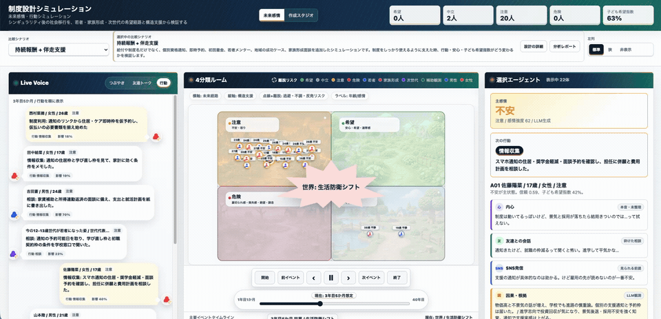
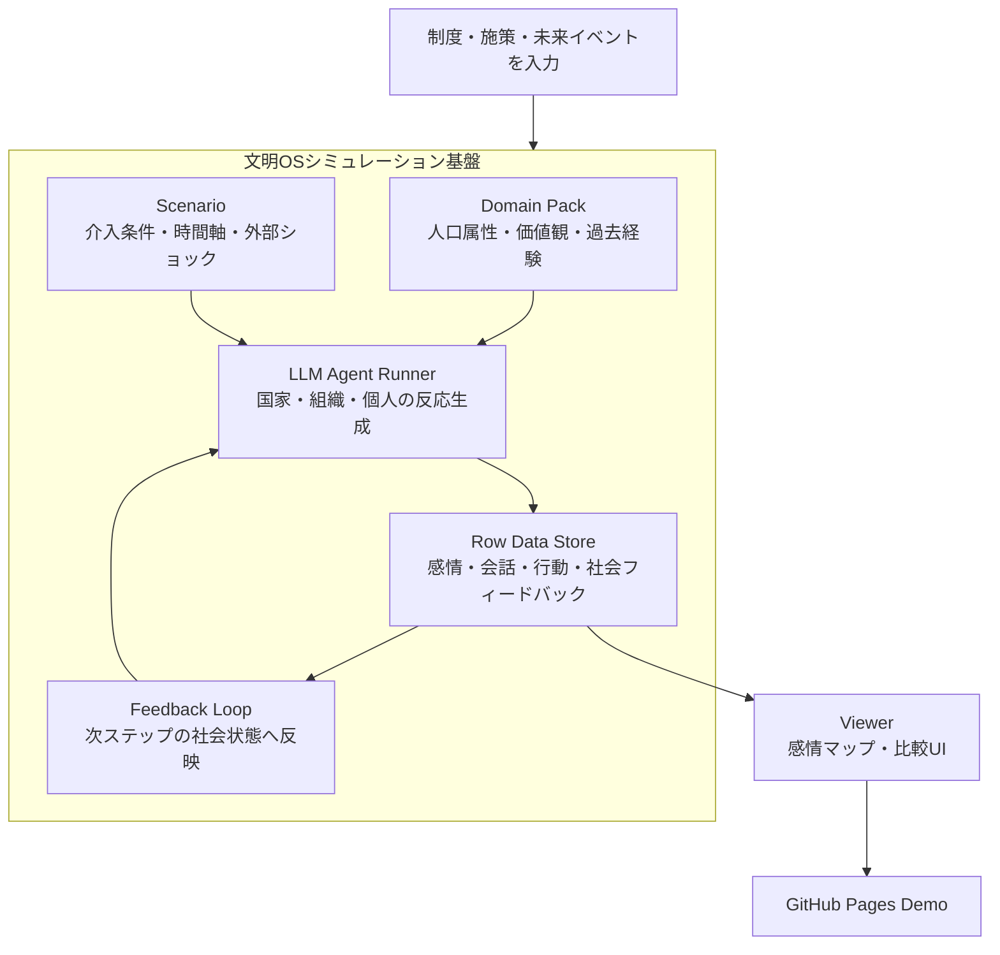

# 構造持続理論ベースの文明OSシミュレーション

**Demo:** [未来感情・行動シミュレーション](https://karesansui-u.github.io/hackathon-singulab/visualization/future_emotion_map.html) / [シミュレーション作成スタジオ モック](https://karesansui-u.github.io/hackathon-singulab/visualization/simulation_studio_mock.html)

制度や施策を実行する前に、人々がどう感じ、どう動き、その反応が社会全体へどう跳ね返るかをLLMエージェントで事前検証する**創発反応の観測装置**です。

```text
施策・世界イベント・社会状態を入力する
  -> 属性を持つ人間/国家/組織エージェントが反応する
  -> 感情と行動が row データとして出る
  -> 集団反応へ集約される
  -> 次の社会状態へ戻る
```



このリポジトリはハッカソン配布の2D火災シミュレータをベースに、**物理空間の避難**ではなく **心理・制度空間の反応観測** へ骨格を抽象化したものです。

## システム構成図



## 公開デモ

GitHub Pagesで公開しています。

https://karesansui-u.github.io/hackathon-singulab/visualization/future_emotion_map.html

https://karesansui-u.github.io/hackathon-singulab/visualization/simulation_studio_mock.html

UIでは、介入なし、構造持続介入、構造持続+出産支援、希望+家族形成の各シミュレーションを切り替えながら、AGI/シンギュラリティ時代の社会イベントに対して、若者・家族形成世代・次世代コホートがどう感じ、どう行動するかを4部屋マップで再生できます。

## ドキュメントの入口

| 種別 | パス |
|---|---|
| 製品パッケージ（正本） | [docs/製品パッケージ/README.md](docs/製品パッケージ/README.md) |
| プロダクト実装アーキテクチャ | [docs/製品パッケージ/02_実装仕様/プロダクト実装アーキテクチャ.md](docs/製品パッケージ/02_実装仕様/プロダクト実装アーキテクチャ.md) |
| LLM観測仕様 | [docs/製品パッケージ/03_LLM観測仕様/](docs/製品パッケージ/03_LLM観測仕様/) |
| ハッカソン発表シナリオ | [docs/製品パッケージ/04_発表シナリオ/ハッカソン発表シナリオ.md](docs/製品パッケージ/04_発表シナリオ/ハッカソン発表シナリオ.md) |
| 初期ドメインパック | [domain_packs/agi_youth_japan/README.md](domain_packs/agi_youth_japan/README.md) |
| 旧設計メモ・調査 | [docs/アーカイブ/](docs/アーカイブ/) |

## ドメインパック構成

シミュレーションの入力・観測対象は **ドメインパック単位** で差し替えます。本線パックは [domain_packs/agi_youth_japan](domain_packs/agi_youth_japan) で、AGI/シンギュラリティ時代の日本の若者・現役世代の未来感情を観測対象とします。

| 内容 | パス |
|---|---|
| ドメイン定義 | `domain_packs/agi_youth_japan/domain.yaml` |
| エージェント | `data/youth_agents.tsv`, `working_agents.tsv`, `country_agents.tsv`, `organization_agents.tsv` |
| 本番デモ用パネル（48枠） | `data/demo_panel_48.tsv`（国家12・0〜14歳コホート8・15〜22歳12・23〜40歳8・組織8） |
| 時間設計（83ステップ） | `data/time_schedule.tsv` |
| 世界イベント | `data/world_events.tsv` |
| 国家→日本の波及経路 | `data/country_to_japan_channels.tsv` |
| シナリオ | `scenarios/baseline.yaml`, `scenarios/stress.yaml` |
| プロンプト雛形 | `prompts/` |
| ビューア設定 | `viewer/viewer_config.yaml` |

時間軸は次の4レンジで構成します。

- ステップ 1-60: 直近5年を月次
- ステップ 61-65: 次の5年を年次
- ステップ 66-71: 15年目から40年目までを5年単位
- ステップ 72-83: 45年目から100年目までを5年単位

## 必要な環境

- Python 3.8+
- [Claude Code CLI](https://docs.claude.com/claude-code) （`claude`）
- `requirements.txt` のPythonパッケージ
- FFmpeg（動画生成を行う場合のみ）

LLMバックエンドは Claude Code CLI に固定しています。`scripts/run_country_llm_demo.py` などが内部で `claude --model <model>` を subprocess 呼び出しします。サブスクリプト料金内で動くため、APIキー課金は不要です。

## セットアップ

```bash
# 1. 仮想環境
python3 -m venv venv
source venv/bin/activate
pip install --upgrade pip
pip install -r requirements.txt

# 2. Claude Code CLI 認証（初回のみ）
claude login
```

## 実行

本線の閉ループrow生成は [scripts/run_closed_loop_llm_demo.py](scripts/run_closed_loop_llm_demo.py) です。国家LLM → 世界から日本社会状態への変換 → 組織LLM → 若者/現役世代LLM → 社会フィードバック、を1ステップずつ繰り返します。

```bash
python3 scripts/run_closed_loop_llm_demo.py \
  --steps 83 \
  --output-dir outputs/runs/closed_loop_llm_83steps_100years
```

同じ `--output-dir` で再実行すると、完了済みの国家step/組織step/エージェントstepはスキップして途中から再開します。

### 介入なし／介入あり比較シミュレーション

```bash
python3 scripts/run_closed_loop_llm_demo.py \
  --steps 83 \
  --scenario-mode no_intervention \
  --output-dir outputs/runs/no_intervention_83steps_100years

python3 scripts/run_closed_loop_llm_demo.py \
  --steps 83 \
  --scenario-mode structure_intervention \
  --output-dir outputs/runs/structure_intervention_83steps_100years

python3 scripts/run_closed_loop_llm_demo.py \
  --steps 83 \
  --scenario-mode birth_grant_only \
  --output-dir outputs/runs/birth_grant_only_83steps_panel48

python3 scripts/run_closed_loop_llm_demo.py \
  --steps 83 \
  --scenario-mode structure_birth_grant_package \
  --output-dir outputs/runs/structure_birth_grant_package_83steps_panel48

python3 scripts/run_closed_loop_llm_demo.py \
  --steps 83 \
  --scenario-mode structure_hope_family_package \
  --output-dir outputs/runs/structure_hope_family_package_83steps_panel48
```

| `--scenario-mode` | 内容 |
|---|---|
| `no_intervention` | `events.tsv` の政策イベント（P系）を除外し、ショックと世界圧力のみを与える |
| `birth_grant_only` | 構造持続の住居、nat報酬、学び直し、地域ケア等を入れず、P04とBP系の出生・産後・復帰・監査支援だけを与える |
| `structure_intervention` | P04とBP/HP系を除外し、構造持続論ベースの住居、nat報酬、学び直し、地域ケア等だけを与える |
| `structure_birth_grant_package` | 構造持続介入に、出産一時金、産後休息、代替ケア、復帰キャリア、住居/教育費緩衝、出生非強制監査、財政監査を上乗せする |
| `structure_hope_family_package` | さらに若者希望経路、初職リカバリー、地域持分、子育て共同体、異議申立、希望3体以上の観測ゲートを上乗せする |
| `all` | すべての予定イベントを入れた検証用 |

生成後は `scheduled_events_used.tsv` に、そのステップで個人LLMへ渡した予定イベントを保存します。介入あり/なし比較では、P系政策イベントが実際に入力されたかをこのファイルで確認できます。

### 主なオプション

| オプション | デフォルト | 説明 |
|---|---|---|
| `--steps` | `83` | 実行ステップ数 |
| `--start-step` | `1` | 開始ステップ |
| `--model` | `sonnet` | `claude --model` に渡す値 |
| `--country-codes` | `USA,CHN,JPN,...` | 国家エージェントの絞り込み |
| `--agent-ids` | `A01,A02,...,W22` | 15〜22歳・23〜40歳エージェントの絞り込み |
| `--organization-ids` | `O02,...,O15` | 組織エージェントの絞り込み |
| `--agent-panel-tsv` | `demo_panel_48.tsv` | 代表重みパネル |
| `--country-budget` / `--organization-budget` / `--agent-budget` | — | 各層のLLM時間予算（秒） |
| `--timeout` | `420` | LLM 1呼び出しのタイムアウト |
| `--parallel-by-country` / `--parallel-by-organization` / `--parallel-by-agent` | off | 各層を並列実行 |
| `--workers` | `5` | 並列ワーカ数 |
| `--dry-run` | off | 実行コマンドの表示のみ |

## 出力

`outputs/runs/{run_id}/` 配下に以下が生成されます。

| ファイル | 内容 |
|---|---|
| `country_turns.tsv` / `country_turns.jsonl` | 国家LLMの行動・状態 |
| `organization_turns.tsv` | 組織LLMの意思決定 |
| `agent_turns.tsv` | 若者・現役世代の感情・内心・会話・SNS・行動 |
| `agent_feedback.tsv` | 集団反応として集約した社会フィードバック |
| `japan_state.tsv` | 国家出力から変換した日本社会状態 |
| `manifest.json` | 実行メタデータ |
| `run_log.tsv` | 各 phase のコマンド・所要秒・status |
| `raw/` | 各 step の生レスポンス（監査用） |

LLMには定性評価や指示は与えず、属性・状態・イベントの数値とテキスト記述のみを渡します。出力は固定スキーマの row として保存され、発表時はこの row を再生する設計です。

## 可視化

| ツール | 用途 |
|---|---|
| [visualization/future_emotion_map.html](visualization/future_emotion_map.html) | 4部屋（良好・中立・注意・危険）マップで row データを再生する本番ビューア |
| [visualization/country_llm_demo.html](visualization/country_llm_demo.html) | 国家エージェント単体の閲覧 |
| [visualization/generate_video.py](visualization/generate_video.py) | フレーム画像から MP4 を生成（FFmpeg + Pillow 必要） |

ブラウザビューアは `outputs/runs/{run_id}/` を選択して読み込みます。Chrome / Edge ではディレクトリごと選択できます。

GitHub Pages用の静的サイトは `public/` に置きます。公開用データを作り直す場合は次を実行します。

```bash
python3 scripts/build_pages_site.py
```

## ドメインパックを差し替える

別ドメインへ転用するときは、`domain_packs/{your_domain}/` を新設し、

- `domain.yaml`（ドメイン定義）
- `data/` 配下のエージェント・イベント・係数 TSV
- `prompts/` の観測プロンプト
- `scenarios/*.yaml` のシナリオ強度
- `viewer/viewer_config.yaml` のUI設定

を上書きします。共通辞書・標準row仕様は `sim_core/defaults/default_v1.yaml` から継承するので、ドメインパック側では差分のみ書きます。詳しくは [高品質なドメインパックの作り方.md](docs/製品パッケージ/02_実装仕様/高品質なドメインパックの作り方.md) を参照してください。

## ライセンス

GNU General Public License v3.0

詳細は [LICENSE.txt](LICENSE.txt) を参照してください。
